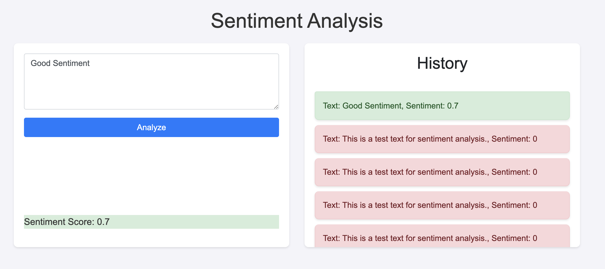
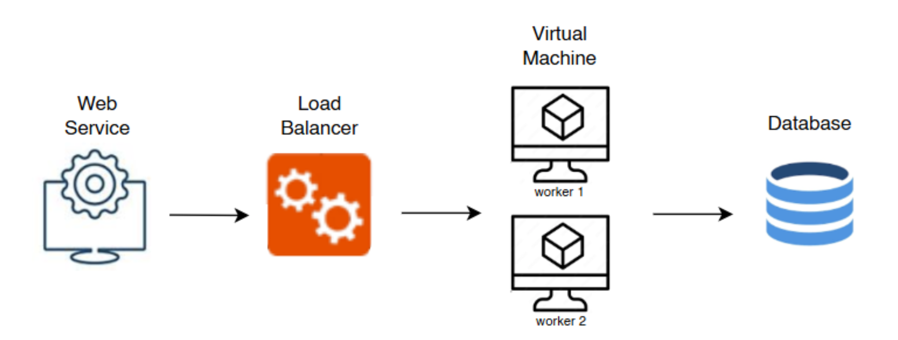

# Final Project Komputasi Awan

## Kelompok A4

| Nama | NRP |
|-----------------------|--------------|
| Muhammad Arsy Athallah | 5027221048 |
| Irfan Qobus Salim| 5027221058 |
| Hafiz Akmaldi Santosa| 5027221061 |
| Naufan Zaki Luqmanulhakim| 5027221065 |

## Permasalahan

Anda adalah seorang lulusan Teknologi Informasi, sebagai ahli IT, salah satu kemampuan yang harus dimiliki adalah Keampuan merancang, membangun, mengelola aplikasi berbasis komputer menggunakan layanan awan untuk memenuhi kebutuhan organisasi.

Pada suatu saat anda mendapatkan project untuk mendeploy sebuah aplikasi Sentiment Analysis dengan komponen Backend menggunakan python: sentiment-analysis.py dengan spesifikasi sebagai berikut

## Endpoints

1. Analyze Text
    - **Endpoints:** `POST /analyze`
    - **Description:**  This endpoint accepts a text input and returns the sentiment score of the text.

    - **Requests:**
    ~~~
    {
    "text": "Your text here"
    }
    ~~~

    - **Response:**
    ~~~
    {
    "sentiment": <sentiment_score>
    }
    ~~~

2. Retrieve History
    - **Endpoint:** `GET /history`
    - **Description:** This endpoint retrieves the history of previously analyzed texts along with their sentiment scores.
    - **Response:**
    ~~~
    {
        {
   "text": "Your previous text here",
   "sentiment": <sentiment_score>
    }, 
    ...
    }
    ~~~

    Kemudian juga disediakan sebuah Frontend sederhana menggunakan index.html dan styles.css dengan tampilan antarmuka sebagai berikut
    
    Kemudian anda diminta untuk mendesain arsitektur cloud yang sesuai dengan kebutuhan aplikasi tersebut. Apabila dana maksimal yang diberikan adalah 1 juta rupiah per bulan (65 US$) konfigurasi cloud terbaik seperti apa yang bisa dibuat?

    ## Rancangan Arsitektur Cloud

    Pada rancangan ini kami menggunakan model yaitu 1 web service, 1 load balancer, 2 worker, dan 1 database seperti gambar berikut:
   
    

    pada rancangan tersebut kami menggunakan Google Cloud Platform dengan spesifikasi seperti berikut:

   

    | Nama | Spesifikasi | Harga |
    |-----------------------|--------------| --------- |
    | Client - 10.184.0.5 | 2 vCPU + 4 GB memory + 25 GB disk | $9.52 |
    | Database - 10.184.0.4 | 2 vCPU + 4 GB memory + 25 GB disk | $9.52 |
    | Load Balancer - 10.184.0.3| 2 vCPU + 4 GB memory + 25 GB disk |  $9.52 |
    | Worker 1 - 10.184.0.2 | 2 vCPU + 4 GB memory + 25 GB disk | $9.52 |
    | Worker 2 - 10.184.0.6 | 2 vCPU + 4 GB memory + 25 GB disk | $9.52 |
    |Total | | $47.6 |

    ## Implementasi

    ### Set Up dan Konfigurasi Database
    
    
    lakukan config awal untuk meng set up database dengan menggunakan command seperti ini:
    ~~~
    sudo apt update
    sudo apt upgrade

    # Install dependency
    sudo apt install gnupg wget apt-transport-https ca-certificates software-properties-common
    echo "deb http://security.ubuntu.com/ubuntu focal-security main" | sudo tee /etc/apt/sources.list.d/focal-security.list
    sudo apt-get update
    sudo apt-get install libssl1.1

    # Install mongodb
    wget -qO- https://pgp.mongodb.com/server-7.0.asc | gpg --dearmor | sudo tee /usr/share/keyrings/mongodb-server-7.0.gpg >/dev/null
    echo "deb [ arch=amd64,arm64 signed-by=/usr/share/keyrings/mongodb-server-7.0.gpg ] https://repo.mongodb.org/apt/ubuntu $(lsb_release -cs)/mongodb-org/7.0 multiverse" | sudo tee -a         /etc/apt/sources.list.d/mongodb-org-7.0.list
    sudo apt update
    sudo apt install mongodb-org -y
    ~~~

    Lanjutkan untuk Enable MongoDb dengan commmand seperti berikut:
    ~~~
    sudo systemctl start mongod
    sudo systemctl enable mongod
    ~~~

    Masuk ke Konfigurasi MongoDB dengan `sudo nano /etc/mongod.conf`

    

    

    Membuat User dan Pass

    

    

    ### Set Up Client

    

    ### Set Up Worker - 1

    

    ### Set Up Worker - 2

    

   ### Uji Coba Di Locust

   **Berikut merupakan IP yang digunakan: 34.101.54.162
34.101.181.48**

   

   

   400 - 100

   

   400 - 200

   

   400 - 500

   

   

   

   ## Kesimpulan

   Bisa disimpulkan bahwa client tidak memiliki pengaruh yang besar dalam arsitektur cloud dan juga semakin besar balance yang diprovide dari suatu cloud service maka request per second yang dihasilkan akan semakin besar

    

    

    
